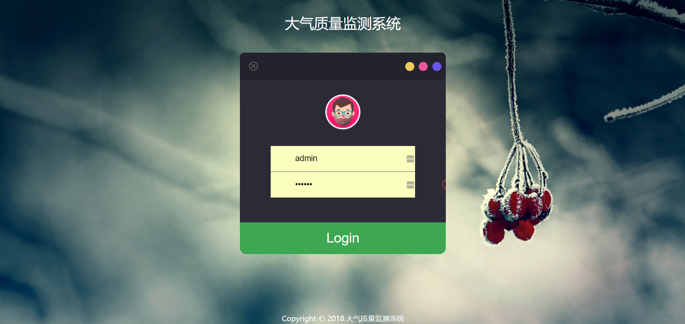
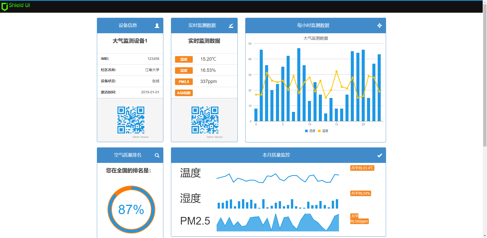

  

# Air - A Typical Iot Application Solutions. 大气质量检测系统. 物联网温湿度以及灰尘PM2.5采集监控. 

  

## Introduction. 主要介绍

Air - 大气质量检测系统。主要数据流程为 :物联网Stm32传感设备 -> (WIFI模块) -> TcpSocket服务器 -> Web后端服务器 -> 数据库 -> Web前端展示。以及包含Android移动端相关应用。完成了一整个物联网应用场景的流程。

## Language. 开发语言

* Java :5/7
* C :1/7
* Kotlin :1/7 

## Projects. 子项目一览

#### 初始化子项目:

> 子项目挂载在其他git仓库中，父项目仅保留子项目引用，可使用以下命令将子项目clone到当前父项目中。

    git submodule init

    git submodule update

**[Air-Iot](https://github.com/kevinten10/Air-Iot)** :基于指南者Stm32开发板进行开发，通过传感器感知大气质量指标，通过WIFI模块进行TCP通信，完成物联网嵌入式设备的构建。

**[Air-Protocol](https://github.com/kevinten10/Air-Protocol)** :定义十六进制协议和数据实体对象，提供十六进制字符串和实体对象之间的转换工具，其他服务基于第三方Protocol服务进行协议编解码。

**[Air-Room](https://github.com/kevinten10/Air-Room)** :模拟物联网设备通过Socket发送TCP数据包，建立调度线程池，添加虚拟传感器对象，模拟大气环境检测系统，通过Socket推送Tcp模拟数据包到服务器。

**[Air-Server](https://github.com/kevinten10/Air-Server)** :TCP_SERVER服务端，监听物联网设备发送的TCP数据包，将TCP数据包编解码后通过HTTP发送到BACK端进行数据存储更新。

**[Air-Back](https://github.com/kevinten10/Air-Back)** :数据交互服务后端，基于SpringBoot快速开发后台数据服务，提供REST接口调用，基于Mybatis实现数据的CRUD操作。

**[Air-Webapp](https://github.com/kevinten10/Air-Webapp)** :WEB数据展示网站，基于Servlet+Jdbc搭建，进行监测数据的展示。

**[Air-Phone](https://github.com/kevinten10/Air-Phone)** :基于Kotlin，移动端接收嵌入式设备发送的数据包，并通过HTTP发送到WEB服务器。

## Technology Stack. 技术栈

|服务|技术栈|其他|
|---|---|---|
|Air-Iot|Stm32开发板，DHT11温湿度模块，ESP8266WIFI模块|Keil Mdk5 进行程序烧写|
|Air-Protocol|Java十六进制编解码||
|Air-Room|Swing可视化编程，Socket客户端|依赖protocol服务进行模拟协议数据的生成|
|Air-Server|Smart-Socket服务端，Http客户端|依赖protocol服务进行协议编解码|
|Air-Back|Springboot，Mybatis，Http服务端|需配置MySQL数据库|
|Air-Webapp|Jsp，Servlet，Jdbc||
|Air-Phone|Kotlin ...|

#### 提示: 

依赖protocol的意思是 :需要把protocol项目打包成jar(Maven或IDEA)，然后作为本机jar包添加到依赖工程中去。

## Architecture. 运行流程

  

## Deploy. 快速部署

#### 1.1 部署嵌入式设备 :

1. 购买野火指南者STM32开发板，配置好KeilMdk5开发IDE环境(为方便开发，可用Clion或其他C语言IDE进行程序开发，仅适用Keil进行程序烧写)。
2. 将 **[Air-Iot](https://github.com/kevinten10/Air-Iot)** 程序烧写到开发板中，具体配置请打开查看
3. 首先运行TCP网络调试工具，监听指定端口，查看是否收到数据包。

#### 1.2 部署虚拟嵌入式设备 :

1. 启动 **[Air-Room](https://github.com/kevinten10/Air-Room)** 数据模拟服务，运行后将通过SOCKET发送模拟的数据包到TCP-SERVER服务处，修改相关配置，确保发送端口和TCP-SERVER监听端口一致(默认)。

#### 2 以上服务选择一种部署完成后：

1. 启动 **[Air-Server](https://github.com/kevinten10/Air-Server)** TCP-SERVER服务，进行端口的监听，接收TCP数据包，并通过HTTP将数据发送到BACK服务。
2. 启动 **[Air-Back](https://github.com/kevinten10/Air-Back)** BACK服务，接收HTTP请求，将数据写入到MySQL数据库中，需按照说明配置好MySQL数据库。

#### 3 进行数据展示:

1. 启动 **[Air-Webapp](https://github.com/kevinten10/Air-Webapp)** 配置好JDBC相关配置，可展示BACK服务存储的数据。

#### 移动端:

* TODO

### 或者可以: 

1. 建立数据库: sql文件详见 **/sql/sql文件**

2. 启动数据交互服务，[Air-Back](https://github.com/kevinten10/Air-Back)，并修改其中的数据库配置文件为用户建立的数据库信息

3. 启动TCP通信服务，[Air-Server](https://github.com/kevinten10/Air-Server)，或者通过 **/网络调试工具/NetAssist.exe** ，直接查看TCP接收内容

4. 启动数据发送服务，运行模拟器 [Air-Room](https://github.com/kevinten10/Air-Room) ，或者将 [Air-Iot](https://github.com/kevinten10/Air-Iot) 烧写到开发板中。
   
5. 登录数据展示网站，观看数据交互结果 [Air-Webapp](https://github.com/kevinten10/Air-Webapp)

## 或者您想随便试试？

1. 单独启动 **[Air-Room](https://github.com/kevinten10/Air-Room)** ，会不断产生模拟数据，并打印到控制台，若服务端未启动，会打印"TCP FAILURE"，说明发送失败。

2. 单独启动 **[Air-Server](https://github.com/kevinten10/Air-Server)** ，可供学习TCP_SERVER操作，基于smart-socket框架，可通过网络调试工具手动发送tcp数据包，观察运行流程。

3. 单独启动 **[Air-Back](https://github.com/kevinten10/Air-Back)** ，需配置好数据库，单独启动没卵用，简单的REST接口服务。

4. 单独启动 **[Air-Webapp](https://github.com/kevinten10/Air-Webapp)** ，配置好数据库，能查看数据，简单的网站功能。

## DEMO

#### 引脚连接

#### 登录界面

#### 数据展示界面（默认最近二十条）

### 云服务器演示网址：[http://47.100.236.64:8080/air/](http://47.100.236.64:8080/air/)

## License

Copyright (c) 2018-present kevinten10

