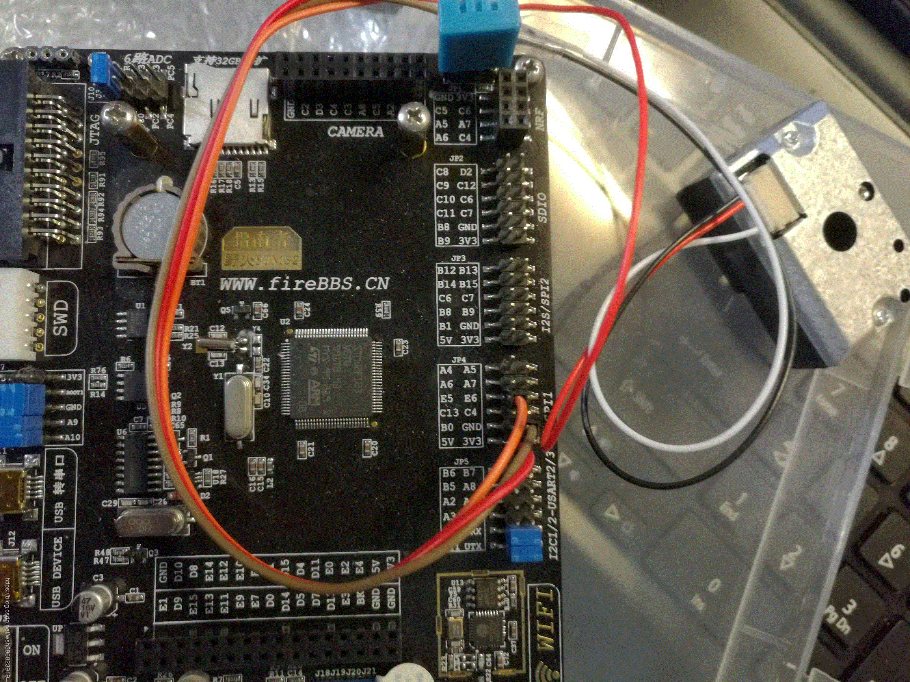
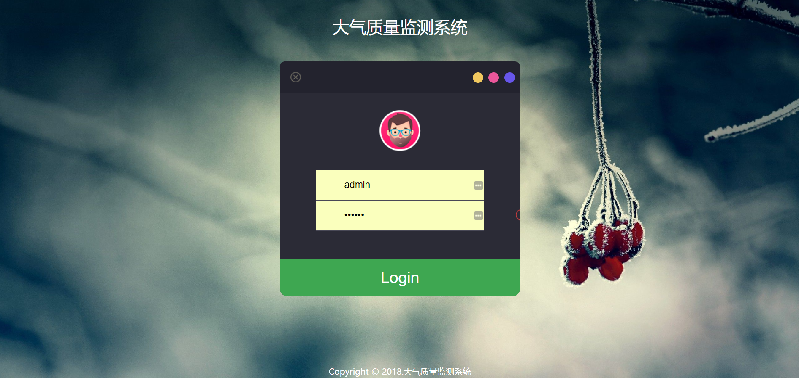
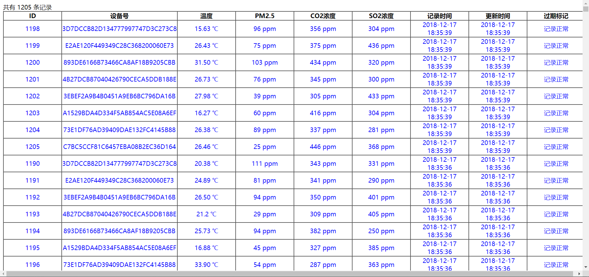

<p align="center">
  
</p>

<h1 align="center">Air - 大气质量监测系统</h1>

<p align="center">
  <strong>A Typical IoT Application Solution</strong><br/>
  <strong>物联网温湿度及 PM2.5 采集监控平台</strong>
</p>

<p align="center">
  
  
  
  
  
  
</p>

---

## 📖 项目简介

**Air** 是一个完整的物联网大气质量监测解决方案，实现了从嵌入式传感器采集、网络传输、数据存储到可视化展示的全流程。系统可实时监测温度、湿度、PM2.5 等大气质量指标，适用于智能家居、环境监测、智慧农业等场景。

### 核心特性

| 特性 | 描述 |
|------|------|
| 🔌 **多语言架构** | Java + C + Kotlin 多语言技术栈 |
| 📡 **物联网采集** | 基于 STM32 的嵌入式传感设备 |
| 🌐 **网络通信** | TCP Socket + HTTP RESTful API |
| 📊 **数据可视化** | Web 端实时数据展示 |
| 📱 **移动应用** | Android 移动端支持 |

---

## 🏗️ 系统架构

### 数据流程

```
┌─────────────┐     WiFi/TCP      ┌─────────────┐     HTTP      ┌─────────────┐
│  STM32 IoT  │ ─────────────────→ │ TCP Server  │ ────────────→ │   Backend   │
│  Device     │                    │  (Java)     │               │ (SpringBoot)│
└─────────────┘                    └─────────────┘               └──────┬──────┘
                                                                        │
                                    ┌─────────────┐                    │
                                    │  Android    │ ←──────────────────┘
                                    │   Mobile    │        HTTP
                                    └─────────────┘
                                                                        │
                                    ┌─────────────┐                    │
                                    │   Web UI    │ ←──────────────────┘
                                    │(JSP/jQuery) │        HTTP
                                    └─────────────┘
```

### 架构层次

| 层次 | 技术 | 功能 |
|------|------|------|
| **感知层** | STM32 + DHT11 + PM2.5传感器 | 数据采集 |
| **网络层** | ESP8266 WiFi + TCP Socket | 数据传输 |
| **服务层** | SpringBoot + Smart-Socket | 业务处理 |
| **展示层** | JSP + Bootstrap + jQuery | 数据可视化 |
| **移动端** | Kotlin + HTTP | 移动监控 |

---

## 🚀 子项目一览

### 🔧 初始化子项目

> 子项目挂载在其他 Git 仓库中，父项目仅保留子项目引用。使用以下命令初始化：

```bash
git submodule init
git submodule update
```

### 📦 核心模块

#### **Air-Iot** - 嵌入式物联网设备
- **语言**: C
- **硬件**: STM32 指南者开发板、DHT11 温湿度模块、ESP8266 WiFi 模块
- **功能**: 传感器数据采集、TCP 网络通信
- **开发工具**: Keil MDK5
- [源码](https://github.com/kevinten10/Air-Iot)

#### **Air-Protocol** - 通信协议定义
- **语言**: Java
- **功能**: 十六进制协议编解码、数据实体转换
- **说明**: 需要打包为 JAR 包供其他服务依赖
- [源码](https://github.com/kevinten10/Air-Protocol)

#### **Air-Room** - 数据模拟器
- **语言**: Java
- **技术**: Swing GUI、Socket 客户端
- **功能**: 模拟传感器数据发送、虚拟环境检测
- **依赖**: Air-Protocol
- [源码](https://github.com/kevinten10/Air-Room)

#### **Air-Server** - TCP 服务端
- **语言**: Java
- **技术**: Smart-Socket、HTTP 客户端
- **功能**: TCP 数据包监听、协议编解码、HTTP 转发
- **依赖**: Air-Protocol
- [源码](https://github.com/kevinten10/Air-Server)

#### **Air-Back** - 后端数据服务
- **语言**: Java
- **技术**: SpringBoot、MyBatis、MySQL
- **功能**: REST API、数据 CRUD、业务逻辑
- [源码](https://github.com/kevinten10/Air-Back)

#### **Air-Webapp** - Web 数据展示
- **语言**: Java + JavaScript
- **技术**: JSP、Servlet、JDBC、jQuery、Bootstrap
- **功能**: 监测数据可视化、历史数据查询
- [源码](https://github.com/kevinten10/Air-Webapp)

#### **Air-Phone** - Android 移动端
- **语言**: Kotlin
- **技术**: HTTP 客户端
- **功能**: 移动端数据接收、远程监控
- [源码](https://github.com/kevinten10/Air-Phone)

---

## 🛠️ 技术栈

| 模块 | 技术栈 | 说明 |
|------|--------|------|
| **Air-Iot** | STM32、DHT11、ESP8266 | Keil MDK5 烧写 |
| **Air-Protocol** | Java 十六进制编解码 | 协议转换工具 |
| **Air-Room** | Swing、Socket | 数据模拟生成 |
| **Air-Server** | Smart-Socket、HTTP | TCP 服务端 |
| **Air-Back** | SpringBoot、MyBatis | REST 数据服务 |
| **Air-Webapp** | JSP、Servlet、JDBC | Web 展示 |
| **Air-Phone** | Kotlin HTTP | 移动端 |

### 依赖说明

> **依赖 Protocol**: 需要将 Protocol 项目打包成 JAR（Maven 或 IDEA），作为本地 JAR 包添加到依赖工程中。

---

## 📋 快速部署

### 方案一：部署真实嵌入式设备

1. **准备硬件**
   - 野火指南者 STM32 开发板
   - DHT11 温湿度传感器
   - ESP8266 WiFi 模块

2. **配置开发环境**
   - 安装 Keil MDK5
   - 可选：使用 CLion 编写代码，Keil 仅用于烧写

3. **烧写程序**
   - 将 [Air-Iot](https://github.com/kevinten10/Air-Iot) 烧写到开发板
   - 使用 TCP 网络调试工具验证数据接收

### 方案二：部署虚拟设备（推荐测试）

1. 启动 [Air-Room](https://github.com/kevinten10/Air-Room) 模拟器
2. 配置端口与 TCP-SERVER 一致（默认）
3. 自动发送模拟数据包

### 服务端部署

```bash
# 1. 初始化数据库
mysql -u root -p < sql/sql文件

# 2. 启动后端服务
cd air-back
mvn spring-boot:run

# 3. 启动 TCP 服务端
cd air-server
mvn spring-boot:run

# 4. 启动 Web 服务
cd air-webapp
mvn tomcat7:run
```

### 数据展示

- 访问 Web 站点：[http://www.lifecat.club/air/](http://www.lifecat.club/air/)
- 或本地部署后访问 `http://localhost:8080/air-webapp`

---

## 🎯 快速体验

### 单独体验各模块

#### 1. Air-Room（数据模拟）
```bash
cd air-room
mvn exec:java
# 观察控制台模拟数据输出
# "TCP FAILURE" 表示服务端未启动
```

#### 2. Air-Server（TCP 服务）
```bash
cd air-server
mvn spring-boot:run
# 使用网络调试工具手动发送 TCP 数据包测试
```

#### 3. Air-Back（REST 服务）
```bash
cd air-back
# 配置 application.yml 中的数据库连接
mvn spring-boot:run
# 访问 http://localhost:8080/swagger-ui.html 查看 API
```

#### 4. Air-Webapp（Web 展示）
```bash
cd air-webapp
# 配置 JDBC 连接
mvn tomcat7:run
# 访问 http://localhost:8080/air-webapp
```

---

## 🖼️ 界面展示

### 硬件连接



### Web 登录界面



### 数据展示界面



### 在线演示

🌐 **演示网址**: [http://www.lifecat.club/air/](http://www.lifecat.club/air/)

---

## 🤝 寻求开源合作

我们正在寻找开源贡献者！如果你有想法或想要贡献代码，欢迎参与：

📢 **[提交项目模块功能需求](https://github.com/kevinten10/Air/issues/1)**

### 贡献方式

1. Fork 本仓库
2. 创建特性分支 (`git checkout -b feature/amazing-feature`)
3. 提交更改 (`git commit -m 'Add amazing feature'`)
4. 推送分支 (`git push origin feature/amazing-feature`)
5. 创建 Pull Request

---

## 📚 文档

- [架构设计图](https://github.com/kevinten10/Air/blob/master/air-doc/images/Architecture.png)
- [API 接口文档](air-doc/)
- [部署指南](#deploy-快速部署)

---

## 📜 许可证

Copyright (c) 2018-present kevinten10

本项目采用 Apache License 2.0 许可证

---

<p align="center">
  <strong>物联网 · 环境监测 · 智慧生活</strong>
</p>

<p align="center">
  
</p>
